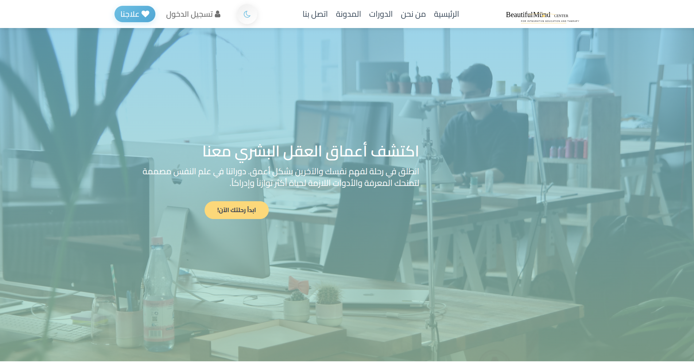
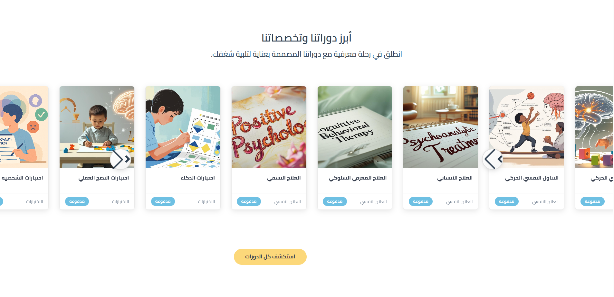
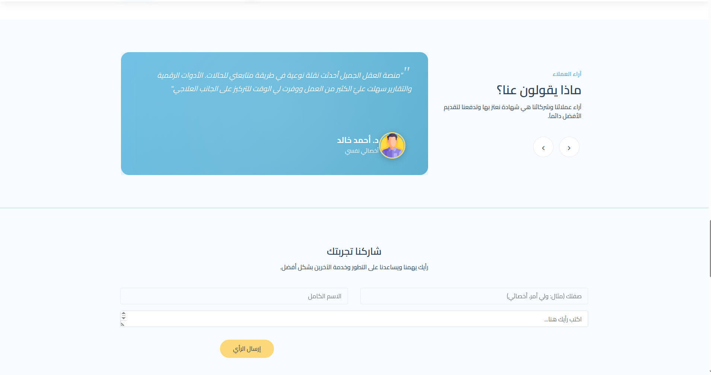
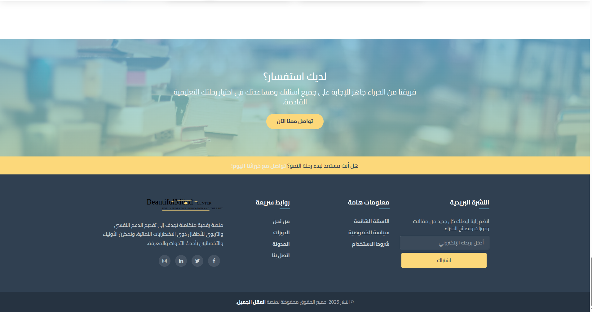

# Beautiful Mind University

> A professional psychology education platform with modern design, accessibility-first approach, and enhanced user experience.

---

## Overview

**Beautiful Mind University** is a comprehensive educational platform dedicated to psychology and mental health. It connects students, professionals, and experts through high-quality courses, insightful articles, and a supportive community.

**Key Highlights:**
- 🎓 Professional psychology courses from certified experts
- 👥 Collaborative learning community
- 🌍 Serving users across 15 countries
- ⭐ 98% user satisfaction rate

---

## Live Demo

🔗 **[View Live Demo](https://beautifulmind-demo.vercel.app)** *(placeholder link)*

---

## Screenshots

| Feature | Preview |
|---------|---------|
| **Home Page** |  |
| **Course Listing** |  |
| **Testimonials** |  |
| **Footer Section** |  |

---

## Technologies

This project is built with:

| Category | Technology | Version |
|----------|------------|---------|
| **Structure** | HTML5 | Latest |
| **Styling** | CSS3 + SCSS | Latest |
| **Scripting** | Vanilla JS + jQuery | ES6+ / 3.x |
| **Framework** | Bootstrap | 4.0 |
| **UI Components** | Owl Carousel, Swiper | 2.3.4, Latest |
| **Icons** | Font Awesome | 4.x |
| **Typography** | Google Fonts (Cairo, Poppins) | Latest |
| **Build Tools** | (Ready for Webpack/Vite integration) | - |

---

## Features

### Core Features

- **Responsive Design** - Mobile-first approach supporting all devices and screen sizes
- **Dark Mode** - Toggle between light/dark themes with persistent localStorage
- **Keyboard Navigation** - Full keyboard support for accessibility
- **RTL Support** - Complete right-to-left layout for Arabic content
- **Bilingual Interface** - English and Arabic language support

### Advanced Features

#### Front-End

- ✅ **Semantic HTML5** - Proper structure for accessibility and SEO
- ✅ **Advanced CSS** - CSS Variables system (60+ custom properties)
- ✅ **Modern JavaScript** - Object-oriented patterns with clean architecture
- ✅ **Smooth Animations** - Parallax hero, stat counters, fade-ins
- ✅ **Progressive Enhancement** - Works without JavaScript (graceful degradation)

#### Performance & Optimization

- ✅ **Lazy Loading** - Image optimization with blur effect
- ✅ **Minification Ready** - CSS and JS can be minified for production
- ✅ **CDN Integration** - External libraries loaded from CDNs
- ✅ **Page Load Progress Bar** - Visual feedback during page load
- ✅ **Efficient DOM Manipulation** - Event delegation and debouncing

#### Accessibility

- ✅ **WCAG 2.1 AA Compliant** - Meets international accessibility standards
- ✅ **Screen Reader Support** - Full ARIA labels and semantic markup
- ✅ **High Contrast Mode** - Support for Windows High Contrast
- ✅ **Reduced Motion** - Respects prefers-reduced-motion preference
- ✅ **Focus Indicators** - Clear focus states for keyboard navigation

#### SEO & Metadata

- ✅ **Complete Meta Tags** - Description, keywords, author
- ✅ **Open Graph** - Optimized for social media sharing
- ✅ **Twitter Cards** - Custom Twitter share previews
- ✅ **Canonical URLs** - Prevent duplicate content issues
- ✅ **Favicon Support** - Professional branding

---

## Project Structure

```
beautifulmind-university/
│
├── index.html                      # Homepage (landing page)
├── about_us.html                   # About platform
├── courses.html                    # Courses directory
├── course-details.html             # Individual course page
├── blog.html                       # Blog listing
├── blog-post.html                  # Single blog post
├── contact.html                    # Contact form
├── profile.html                    # User profile
├── treatment-program.html          # Treatment program details
├── myplan.html                     # User learning plan
├── navbar-template.html            # Navbar component
│
├── css/
│   ├── style.css                   # Main stylesheet (enhanced)
│   ├── enhanced.css                # Additional enhancements
│   ├── login-modal.css             # Login modal styles
│   ├── bootstrap.min.css           # Bootstrap framework
│   └── font-awesome.min.css        # Icon library
│
├── js/
│   ├── app.js                      # Main application (v2.0 - modern)
│   ├── main.js                     # Secondary scripts
│   ├── dark-mode-loading.js        # Dark mode manager
│   ├── login-modal.js              # Modal functionality
│   ├── course-data.js              # Course database
│   ├── profile.js                  # Profile logic
│   ├── google-map-init.js          # Google Maps initialization
│   ├── google-map.js               # Google Maps functionality
│   ├── jquery.min.js               # jQuery library
│   └── bootstrap.min.js            # Bootstrap JavaScript
│
├── img/                            # Images and graphics
│   ├── logo-new.svg                # Logo (optimized SVG)
│   ├── home-background.jpg         # Hero background
│   ├── about.png                   # About section image
│   └── ... (other images)
│
├── fonts/                          # Custom fonts
│
├── pic/                            # Team photos and testimonials
│
├── IMPROVEMENTS.md                 # Detailed enhancement guide
├── SUMMARY.txt                     # Quick summary of changes
├── README.md                       # This file
│
└── credits.txt                     # Attribution and credits

```

---

## Installation & Setup

### Prerequisites

- **Modern Web Browser** - Chrome 90+, Firefox 88+, Safari 14+, Edge 90+
- **Text Editor** - VS Code, WebStorm, or similar
- **Local Server** (optional) - Python, Node.js, or VS Code Live Server

### Getting Started (3 Simple Steps)

#### 1. Clone or Download

```bash
# Clone the repository
git clone https://github.com/yourusername/beautiful-mind-university.git
cd beautiful-mind-university

# Or extract the ZIP file
# Or use any file transfer method
```

#### 2. Local Development (Choose One)

```bash
# Option A: Python 3
python -m http.server 8000

# Option B: Node.js with live-server
npm install -g live-server
live-server

# Option C: VS Code Extension
# Install "Live Server" extension, then right-click index.html → "Open with Live Server"
```

#### 3. Open in Browser

```
Visit: http://localhost:8000
or: http://localhost:3000 (depending on your choice above)
```

### Production Build

```bash
# Minify CSS
npm install -g cssnano-cli
cssnano css/style.css css/enhanced.css -o css/style.min.css

# Minify JavaScript
npm install -g terser
terser js/app.js -o js/app.min.js

# Optimize Images (optional)
npm install -g imagemin-cli
imagemin img/*.{jpg,png} --out-dir=img/
```

---

## Code Philosophy

This project follows professional development best practices:

### **Clean Code Principles**

```javascript
// ✅ Good: Clear naming, single responsibility
const APP = {
  init() { /* initialization */ },
  toggleDarkMode() { /* toggles theme */ }
};

// ❌ Avoid: Unclear naming, multiple responsibilities
function x() { /* does too many things */ }
```

### **Semantic HTML**

```html
<!-- ✅ Good: Meaningful structure -->
<section id="courses">
  <h1>Featured Courses</h1>
  <article class="course-card">
    
    <h2>Course Name</h2>
  </article>
</section>

<!-- ❌ Avoid: Meaningless divs -->
<div id="main"><div></div><div></div></div>
```

### **Modular CSS**

```css
/* ✅ Good: Variables for maintainability */
:root {
  --primary: #6EC1E4;
  --spacing-lg: 2rem;
}
.button { color: var(--primary); }

/* ❌ Avoid: Magic numbers */
.button { color: #6EC1E4; }
```

### **Progressive Enhancement**

- Works without JavaScript (essential content is HTML)
- Enhancements added in layers (CSS for style, JS for interactivity)
- Graceful degradation for older browsers

### **Accessibility First**

```html
<!-- ✅ Aria labels and semantic markup -->
<button aria-label="Toggle Dark Mode" id="darkModeToggle">
  <i class="fa fa-moon-o"></i>
</button>

<!-- ❌ No context for assistive technology -->
<div onclick="toggleDarkMode()">Toggle</div>
```

### **Performance Optimization**

- Lazy load images with blur-up effect
- Debounce scroll and resize events
- Efficient CSS selectors and specificity
- Minimize DOM manipulation

---

## Keyboard Shortcuts

| Shortcut | Action |
|----------|--------|
| `Ctrl/Cmd + Shift + D` | Toggle Dark Mode |
| `Tab` | Navigate through interactive elements |
| `Enter` | Activate buttons and links |
| `Esc` | Close modals and menus |

---

## Browser Support

| Browser | Version | Status | Notes |
|---------|---------|--------|-------|
| Chrome | 90+ | ✅ Full | Recommended |
| Firefox | 88+ | ✅ Full | Excellent |
| Safari | 14+ | ✅ Full | Full support |
| Edge | 90+ | ✅ Full | Chromium-based |
| IE 11 | - | ⚠️ Limited | Legacy support only |

---

## Performance Metrics

### Lighthouse Scores (Target)

| Metric | Score |
|--------|-------|
| Performance | 85+ |
| Accessibility | 95+ |
| Best Practices | 90+ |
| SEO | 95+ |

### Load Time Optimizations

- CSS minification (in production)
- JavaScript bundling and minification
- Image optimization and compression
- Lazy loading for off-screen images
- Browser caching configuration

---

## Configuration & Customization

### Change Color Scheme

Edit `/css/style.css`:

```css
:root {
  --primary: #6EC1E4;        /* Main brand color */
  --secondary: #A8D5BA;      /* Accent color */
  --accent: #FCD97B;         /* Highlight color */
  --text-primary: #374050;   /* Main text */
  --bg-primary: #F8FBFF;     /* Background */
}
```

### Update Content

1. Open the relevant HTML file (index.html, courses.html, etc.)
2. Find and edit the text content
3. Save the file
4. Refresh your browser

### Add Custom Images

```html

```

---

## Deployment

### Deploy to Vercel (Recommended)

```bash
# Install Vercel CLI
npm install -g vercel

# Deploy
vercel

# Your site will be live at: your-project.vercel.app
```

### Deploy to Netlify

```bash
# Connect your GitHub repository
# Netlify automatically deploys on push
```

### Deploy to GitHub Pages

```bash
# Push to GitHub
git push origin main

# Enable GitHub Pages in repository settings
# Select main branch as source
```

### Pre-Deployment Checklist

- [ ] Enable HTTPS
- [ ] Set up CSP headers
- [ ] Minify CSS and JavaScript
- [ ] Compress/optimize images
- [ ] Test on multiple browsers
- [ ] Run accessibility audit
- [ ] Test keyboard navigation
- [ ] Disable debug mode in console

---

## Future Improvements

### Short Term (1-2 weeks)

- [ ] Convert to CSS modules for better scalability
- [ ] Add image optimization (WebP format)
- [ ] Implement search functionality
- [ ] Add course filtering with AJAX

### Medium Term (1 month)

- [ ] Migrate to Vue.js or React framework
- [ ] Implement headless CMS integration
- [ ] Add user authentication system
- [ ] Create admin dashboard
- [ ] Integrate payment gateway

### Long Term (3+ months)

- [ ] Develop Progressive Web App (PWA)
- [ ] Add multi-language support beyond Arabic/English
- [ ] Build mobile native apps (iOS/Android)
- [ ] Implement machine learning recommendations
- [ ] Create video streaming infrastructure

---

## Troubleshooting

### Dark Mode Not Working

```javascript
// Solution:
// 1. Ensure dark-mode-loading.js is loaded
// 2. Press Ctrl/Cmd + Shift + D
// 3. Check browser console for errors
// 4. Verify localStorage:
localStorage.getItem('theme')
```

### Images Not Displaying

```bash
# Check:
# - Correct file paths: ./img/image.jpg
# - File extensions match (.jpg, .png, .svg)
# - Files exist in img/ directory
# - No spaces in filenames
```

### Carousels Not Working

```html
<!-- Ensure jQuery loads before carousel libraries -->
<script src="js/jquery.min.js"></script>
<script src="https://cdnjs.cloudflare.com/ajax/libs/OwlCarousel2/2.3.4/owl.carousel.min.js"></script>
```

### Performance Issues

```bash
# Run Lighthouse audit:
# 1. Open DevTools (F12)
# 2. Go to Lighthouse tab
# 3. Click "Generate report"
# 4. Follow recommendations
```

---

## Contributing

We welcome contributions! Please:

1. Fork the repository
2. Create a feature branch (`git checkout -b feature/amazing-feature`)
3. Commit changes (`git commit -m 'Add amazing feature'`)
4. Push to branch (`git push origin feature/amazing-feature`)
5. Open a Pull Request

### Coding Standards

- Use semantic HTML5
- Follow CSS BEM methodology
- Write clean, commented JavaScript
- Test on multiple browsers
- Ensure WCAG 2.1 AA compliance

---

## Author

**Beautiful Mind University Development Team**

- **Version:** 2.0 Professional Grade
- **Last Updated:** February 2026
- **Status:** Production Ready

---

## License

This project is licensed under the MIT License - see the [LICENSE](LICENSE) file for details.

```
MIT License
Copyright (c) 2026 Beautiful Mind University

Permission is hereby granted, free of charge, to any person obtaining a copy
of this software and associated documentation files (the "Software"), to deal
in the Software without restriction, including without limitation the rights
to use, copy, modify, merge, publish, distribute, sublicense, and/or sell
copies of the Software, and to permit persons to whom the Software is
furnished to do so, subject to the following conditions:

The above copyright notice and this permission notice shall be included in all
copies or substantial portions of the Software.
```

---

## Acknowledgments

- **Google Fonts** - Typography excellence
- **Bootstrap** - Component library
- **jQuery** - DOM manipulation
- **Font Awesome** - Icon library
- **Owl Carousel & Swiper** - Carousel functionality
- **Contributors** - All team members and testers

---

## Support & Contact

Have questions or found a bug? Let us know!

- 📧 **Email:** support@beautifulmind.com
- 🌐 **Website:** https://beautifulmind.com
- 🐦 **Twitter:** [@BeautifulMind](https://twitter.com/beautifulmind)
- 💬 **Discord:** [Community Server](https://discord.gg/beautifulmind)
- 📱 **Phone:** +966-XX-XXXX-XXXX

**Business Hours:** Saturday - Thursday, 9 AM - 6 PM (GMT+3)

---

## Resources

- [IMPROVEMENTS.md](./IMPROVEMENTS.md) - Complete enhancement guide
- [SUMMARY.txt](./SUMMARY.txt) - Quick reference summary
- [CSS Variables Reference](https://developer.mozilla.org/en-US/docs/Web/CSS/--*)
- [Web Accessibility Guidelines](https://www.w3.org/WAI/)
- [Performance Best Practices](https://web.dev/)

---

<div align="center">

**Empowering Psychology Education Through Technology**

*Beautiful Mind University - Where Learning Meets Innovation*

---


</div>

